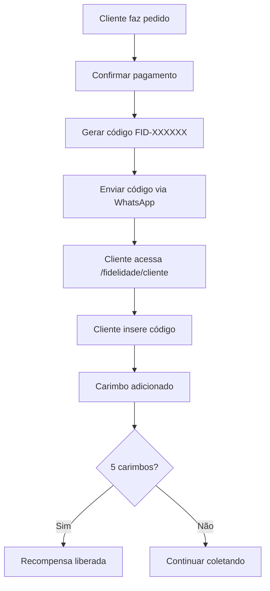

# Novo Sistema de Fidelidade - Cantinho do Pastel

## Visão Geral

Implementamos um novo sistema de fidelidade mais seguro e controlado para a pastelaria. Agora, os clientes precisam provar posse do WhatsApp cadastrado para receber carimbos, evitando fraudes e garantindo que apenas clientes reais participem do programa.

## Como Funciona

### Para a Pastelaria

1. **Gerar Código de Fidelidade**
   - Acesse a página de administração: `/admin/fidelidade`
   - Preencha o nome completo e telefone (WhatsApp) do cliente
   - Clique em "Gerar Código de Fidelidade"
   - Um código único no formato `FID-XXXXXX` será gerado
   - Envie este código ao cliente via WhatsApp

2. **Confirmar Pagamento (Sistema Antigo)**
   - O sistema antigo ainda funciona para clientes que já o utilizavam
   - Confirme o pagamento e adicione carimbos normalmente

### Para os Clientes

1. **Acessar o Programa de Fidelidade**
   - Acesse: `/fidelidade/cliente`
   - Faça login com nome completo e telefone (WhatsApp)

2. **Inserir Código Recebido**
   - Após receber um código da pastelaria via WhatsApp, insira-o na área do cliente
   - O carimbo será adicionado automaticamente ao cartão

## Segurança e Controle

- **Códigos Únicos**: Cada código gerado é único e não pode ser reutilizado
- **Autenticação Real**: Clientes precisam provar posse do WhatsApp cadastrado
- **Rastreabilidade**: Todos os códigos são registrados com data e hora
- **Prevenção de Fraudes**: Códigos não podem ser compartilhados ou reutilizados

## Benefícios

- **Para a Pastelaria**:
  - Controle total sobre quem recebe carimbos
  - Sistema totalmente rastreável
  - Zero possibilidade de fraude
  - Histórico completo de códigos gerados

- **Para os Clientes**:
  - Área pessoal de fidelidade
  - Histórico completo de carimbos
  - Sistema justo e transparente
  - Recompensas reais por fidelidade

## Instruções para a Equipe

1. **Ao Atender um Cliente**:
   - Registre o nome completo e telefone (WhatsApp) do cliente
   - Após confirmar o pagamento, gere um código de fidelidade
   - Envie o código ao cliente via WhatsApp imediatamente

2. **Ao Gerar um Código**:
   - Certifique-se de que os dados do cliente estão corretos
   - O código é gerado automaticamente e é único
   - Copie o código e envie ao cliente via WhatsApp

3. **Em Caso de Dúvidas do Cliente**:
   - Explique que o novo sistema é mais seguro
   - Instrua o cliente a acessar `/fidelidade/cliente` para gerenciar seus carimbos
   - Oriente sobre como inserir o código recebido

## Fluxo Completo

## Suporte

Em caso de problemas técnicos:
- Verifique se o código foi gerado corretamente
- Confirme se o cliente está inserindo o código exatamente como recebido
- Verifique se o código já foi utilizado
- Em caso de dúvidas, consulte o desenvolvedor responsável